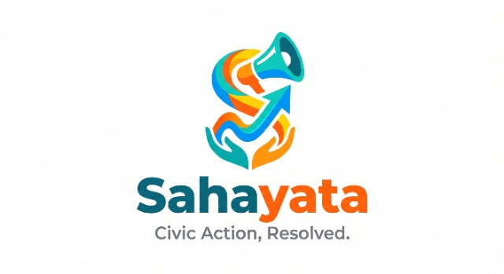

<div align="center">



# Sahayata (CivicCare)
### **Civic Action, Resolved.**

**Municipal Grievance Redressal, Spatial Intelligence & Closed-Loop Accountability Platform**

[](https://react.dev/)
[](https://vitejs.dev/)
[](https://tailwindcss.com/)
[](https://fastapi.tiangolo.com/)
[](https://nodejs.org/)
[](https://leafletjs.com/)
[](https://python.org/)
[](LICENSE)

*Reference Jurisdiction: Brihanmumbai Municipal Corporation (BMC / MCGM) — Ward H/West (Bandra West, Khar West, Santacruz West, Mumbai)*

</div>

---

## 📋 Table of Contents

- [Overview & Municipal Problem Statement](#-overview--municipal-problem-statement)
- [Key Innovations & Algorithmic Engines](#-key-innovations--algorithmic-engines)
  - [1. Multi-Factor Geospatial & Vision Deduplication](#1-multi-factor-geospatial--vision-deduplication)
  - [2. Anti-Deadlock Dynamic SLA Escalation Engine](#2-anti-deadlock-dynamic-sla-escalation-engine)
  - [3. Closed-Loop Citizen Verification & Geo-Fence Audit](#3-closed-loop-citizen-verification--geo-fence-audit)
  - [4. High-Performance Zero-API-Key GIS Radar](#4-high-performance-zero-api-key-gis-radar)
- [Three Stakeholder Portals (RBAC)](#-three-stakeholder-portals-rbac)
- [6-Stage Grievance Lifecycle Pipeline](#-6-stage-grievance-lifecycle-pipeline)
- [System Architecture & Tech Stack](#-system-architecture--tech-stack)
- [Repository Structure](#-repository-structure)
- [Getting Started & Installation](#-getting-started--installation)
  - [Prerequisites](#prerequisites)
  - [1. Frontend Setup (React + Vite)](#1-frontend-setup-react--vite)
  - [2. Node.js Express Backend Setup](#2-nodejs-express-backend-setup)
  - [3. Python FastAPI Vision Engine Setup](#3-python-fastapi-vision-engine-setup)
- [API Reference & Swagger Documentation](#-api-reference--swagger-documentation)
- [Demo Seed Data & Verified Scenarios](#-demo-seed-data--verified-scenarios)
- [Design System & Typography](#-design-system--typography)
- [Contributing & Development Guidelines](#-contributing--development-guidelines)
- [License](#-license)

---

## 🏛️ Overview & Municipal Problem Statement

Traditional urban civic complaint portals and call centers suffer from four systemic points of failure:

1. **Duplicate Flooding**: When an arterial road develops a crater pothole, dozens of citizens file separate complaints. Dashboards are overwhelmed with redundant tickets, dispersing manpower and obscuring true severity.
2. **Bureaucratic Deadlocks**: Complaints with low initial priority or disputed inter-departmental jurisdiction (e.g., PWD road vs. stormwater drain vs. electrical duct) sit unattended indefinitely without automated escalation.
3. **Unilateral "Ghost" Closures**: Field contractors or junior staff frequently mark complaints as "Resolved" in database records without performing quality work, leaving citizens frustrated when the hazard persists.
4. **Static, Non-Spatial Interfaces**: Portals present text tables without live geographic context, making route optimization, cluster detection, and spatial hazard prioritization impossible.

**Sahayata solves this through an end-to-end civic operating system**:
- **Multi-Factor Deduplication**: Clusters incoming reports using Haversine physical distance ($\le 50\text{m}$) and 64-bit perceptual image hashing (`dHash`/`pHash`) before duplicate work orders are issued.
- **Deterministic Anti-Deadlock Aging**: An automated mathematical scoring engine escalates priority points for every hour a ticket remains overdue.
- **Closed-Loop Verification**: A ticket cannot be closed unilaterally. Field engineers must submit photo proof validated against a 100m GPS geo-fence, and citizens must verify resolution using an interactive Before/After split comparison slider.
- **Live GIS Everywhere**: Sub-millisecond raster Leaflet mapping across all screens with zero third-party API keys required.

---

## ⚡ Key Innovations & Algorithmic Engines

### 1. Multi-Factor Geospatial & Vision Deduplication
When a citizen snaps a photo of a hazard, Sahayata intercepts duplicate creation before dispatch:
- **Geographic Proximity**: Calculates spherical distance via Haversine formula against active complaints:
  $$d = 2R \arcsin\left(\sqrt{\sin^2\left(\frac{\Delta\phi}{2}\right) + \cos(\phi_1)\cos(\phi_2)\sin^2\left(\frac{\Delta\lambda}{2}\right)}\right)$$
- **Perceptual Image Hashing**: Downsamples images to $8\times8$ grayscale gradients, computing 64-bit difference hashes (`dHash`). If Hamming distance $\le 10$ and distance $\le 50\text{m}$, the system identifies a duplicate match.
- **Community Endorsement**: Instead of generating duplicate tickets, the citizen's report automatically endorses the primary ticket, boosting its community urgency score and awarding Civic Karma to the contributor.

### 2. Anti-Deadlock Dynamic SLA Escalation Engine
Every ticket's priority score ($0-100$) is computed dynamically in real time:

$$\text{Priority Score} = \min\left(100, \, \text{Base} + \text{DupBonus} + \text{ZoneBonus} + \text{TrafficBonus} + \text{AgingEscalator}\right)$$

| Parameter | Weight / Formula | Description |
|---|---|---|
| **Base Severity** | $20 - 40\text{ pts}$ | Initial category hazard rating (Pothole = 35, Wire = 40, Garbage = 20) |
| **Citizen Endorsements** | $\min(20, \, (\text{Count} - 1) \times 5)$ | Up to $+20\text{ pts}$ based on citizen endorsements in the cluster |
| **Critical Zone Proximity** | $+15\text{ to }+20\text{ pts}$ | Proximity to schools, hospitals, or transit nodes (Lilavati Hospital, National College) |
| **Traffic Density** | $+5\text{ to }+10\text{ pts}$ | Arterial road corridor weighting (Linking Road, Carter Road, S.V. Road) |
| **Anti-Deadlock Aging** | $+2\text{ pts / hour overdue}$ | **Automatic anti-deadlock escalator** past 48h SLA deadline |

### 3. Closed-Loop Citizen Verification & Geo-Fence Audit
Municipal work orders cannot be resolved by administrative decree:
1. **Field Proof Capture**: Ward engineers must upload an on-site resolution photo.
2. **100m Geo-Fence Audit**: Browser/device HTML5 GPS coordinates are compared against the original ticket coordinates. If deviation exceeds $100\text{m}$, an audit alert is flagged.
3. **Interactive Split-Slider**: Citizens receive a split Before/After comparison slider to visually inspect bitumen filling, trench patching, or debris clearance.
4. **Confirm or Dispute**: The citizen officially marks the ticket `Verified Fixed` (releasing full contractor credit) or `Disputed` (reopening the work order with high-priority escalation).

### 4. High-Performance Zero-API-Key GIS Radar
- Uses persistent Leaflet layer groups with zero map flashing on filter/search changes.
- Multi-basemap selector:
  - 🗺️ **Daylight Streets** (OpenStreetMap Raster Cartography)
  - 🌙 **Command Dark** (CartoDB Dark Matter)
  - 🛰️ **Satellite Aerial** (Esri World Imagery High-Resolution)
- Interactive 100m impact radius circles, live incident markers with severity badges, and instant hot-spot jumping.

---

## 👥 Three Stakeholder Portals (RBAC)

Sahayata enforces strict Role-Based Access Control across three distinct user roles:

```
                          ┌─────────────────────────────┐
                          │   Role Select Landing Page  │
                          └──────────────┬──────────────┘
                 ┌───────────────────────┼───────────────────────┐
                 ▼                       ▼                       ▼
     ┌───────────────────────┐ ┌───────────────────┐ ┌───────────────────────┐
     │    CITIZEN PORTAL     │ │ WARD ENGINEER DESK│ │  MLA OVERSIGHT RADAR  │
     ├───────────────────────┤ ├───────────────────┤ ├───────────────────────┤
     │ • One-Click Camera    │ │ • Live Priority Q │ │ • Constituency Radar  │
     │ • AI Issue Classifier │ │ • SLA Timers (48h)│ │ • Hotspot Clusters    │
     │ • Duplicate Alert     │ │ • Geo-Fence Audit │ │ • Direct Escalation   │
     │ • Civic Karma Points  │ │ • Material Dispatch│ │ • Contractor Audits   │
     │ • Split-Slider Verify │ │ • Field Resolution│ │ • SLA Breach Alerts   │
     └───────────────────────┘ └───────────────────┘ └───────────────────────┘
```

---

## 🔄 6-Stage Grievance Lifecycle Pipeline

Every grievance in Sahayata follows a transparent, tamper-proof 6-step lifecycle:

```
[1. REPORTED] ──▶ [2. CLUSTERED] ──▶ [3. PRIORITIZED] ──▶ [4. ASSIGNED] ──▶ [5. RESOLVED] ──▶ [6. VERIFIED]
 Citizen Intake     Deduplication      Dynamic Score        Contractor        Geo-Fenced Photo   Citizen Split-Slider
 GPS + Image        Radius <= 50m      SLA Countdown        Dispatched        On-Site Audit       Confirm / Dispute
```

1. **Reported**: Citizen captures image and GPS location; AI performs intake hazard classification.
2. **Clustered**: System checks for duplicate reports within 50m; clusters complaints or creates a new primary ticket.
3. **Prioritized**: Dynamic priority formula calculates score ($0-100$) and assigns SLA (24h–48h).
4. **Assigned**: Ward H/West engineering desk assigns maintenance crew, equipment, and materials.
5. **Resolved**: Field crew completes repairs and uploads mandatory on-site photo proof with GPS verification.
6. **Verified**: Reporting citizen inspects Before/After photo comparison slider and confirms resolution.

---

## 💻 System Architecture & Tech Stack

### Frontend Architecture
- **Framework**: [React 18](https://react.dev/) + [Vite 6](https://vitejs.dev/) (ES Modules, HMR)
- **Styling**: [TailwindCSS v4](https://tailwindcss.com/) with native CSS variables and design tokens
- **GIS / Mapping**: [Leaflet 1.9](https://leafletjs.com/) with custom HTML divIcons, SVG vector badges, and zero API-key tile layers
- **Icons**: [Lucide React](https://lucide.dev/) (100% SVG icons, zero raw font emojis)
- **Micro-Interactions**: Canvas Confetti for Karma achievements, CSS hardware-accelerated animations

### Backend Architecture
- **Node.js / Express Server (`Backend/server.js`)**:
  - RESTful API engine on port `5000`
  - In-memory data store with JSON persistence (`data/reports.json`, `data/users.json`)
  - Static asset delivery for seed verification photos (`/seeds/*`)
  - Real-time WebSocket broadcasting for multi-client state synchronization
- **Python / FastAPI Vision Engine (`Backend/main.py`)**:
  - High-performance asynchronous API on port `8000`
  - Automated OpenAPI documentation at `/docs`
  - Computer vision perceptual hashing (`dHash` / `pHash`) via [Pillow](https://python-pillow.org/) & [ImageHash](https://github.com/JohannesBuchner/imagehash)
  - Algorithmic priority score computation

---

## 📁 Repository Structure

```
Sahayata/
├── README.md                      # Complete system documentation
├── context.md                     # Deep architectural & municipal context specifications
├── endtoendworkflow.md            # Step-by-step user interaction & verification flows
├── requirements.md                # System requirements & specification contract
│
├── Frontend/                      # React 18 + Vite Frontend Application
│   ├── index.html                 # HTML shell with Google Fonts & favicon
│   ├── package.json               # Frontend dependencies & build scripts
│   ├── vite.config.js             # Vite bundler configuration
│   ├── public/                    # Static public assets
│   │   ├── sahayata-logo.jpg      # Official high-resolution Sahayata logo
│   │   └── seeds/                 # Matched Before/After verification photos (.png)
│   └── src/
│       ├── App.jsx                # Main layout, header lockup, navigation & tab router
│       ├── index.css              # 3-tier typography tokens & Tailwind v4 design system
│       ├── api/
│       │   └── client.js          # REST client with error handling & environment config
│       ├── components/
│       │   ├── auth/              # Role selection & authentication modal cards
│       │   ├── common/            # Shared UI (Webcam modal, split slider, badges)
│       │   ├── map/               # InteractiveCivicMap, ComplaintMiniMap, LocationPicker
│       │   ├── priority/          # PriorityQueueView & SLA escalation tables
│       │   └── ward/              # WardDashboardView & municipal engineering desk
│       ├── data/
│       │   └── civicData.js       # Ward H/West geographic boundaries, hotspots & presets
│       └── utils/
│           ├── deduplication.js   # Client-side Haversine clustering algorithms
│           └── validators.js      # Form validation rules & test suites
│
└── Backend/                       # Dual-Backend Services (Node.js + Python FastAPI)
    ├── server.js                  # Express.js REST API, JSON database & WebSockets
    ├── main.py                    # FastAPI service with OpenCV/ImageHash vision deduplication
    ├── requirements.txt           # Python backend dependencies
    ├── package.json               # Node backend dependencies & scripts
    ├── test_api.py                # Automated pytest suite for FastAPI endpoints
    ├── public/seeds/              # Static seed imagery for demo scenarios
    ├── routers/                   # Modular FastAPI route controllers
    └── data/
        ├── reports.json           # Persistent grievance ticket datastore
        └── users.json             # Seed user accounts & role profiles
```

---

## 🚀 Getting Started & Installation

### Prerequisites
- **Node.js**: v18.0.0 or higher
- **npm**: v9.0.0 or higher
- **Python**: v3.10 or higher (for FastAPI vision service)
- **Git**: For version control

---

### 1. Frontend Setup (React + Vite)

```bash
# Navigate to the frontend directory
cd Frontend

# Install dependencies
npm install

# Start the development server
npm run dev
```

The frontend will be available at: **`http://localhost:5173`**

To verify a production build:
```bash
npm run build
```

---

### 2. Node.js Express Backend Setup

```bash
# Open a new terminal and navigate to the backend directory
cd Backend

# Install Node dependencies
npm install

# Start the Express server
npm run dev
# or: node server.js
```

The Express API will be running on: **`http://localhost:5000`**  
Static seed images served at: **`http://localhost:5000/seeds/`**

---

### 3. Python FastAPI Vision Engine Setup

```bash
# In the Backend directory (or project root with virtual environment)
cd Backend

# Create and activate a Python virtual environment
python -m venv venv

# On Windows:
venv\Scripts\activate
# On Linux/macOS:
source venv/bin/activate

# Install Python requirements
pip install -r requirements.txt

# Launch FastAPI server with auto-reload
uvicorn main:app --host 0.0.0.0 --port 8000 --reload
```

The FastAPI service runs on: **`http://localhost:8000`**  
Interactive Swagger API documentation: **`http://localhost:8000/docs`**

To execute automated tests on the Python endpoints:
```bash
python test_api.py
```

---

## 📡 API Reference & Swagger Documentation

Sahayata provides clean, RESTful APIs across both backend layers:

### Core Endpoints (`Node.js Express / Port 5000`)

| Method | Endpoint | Description | Auth / Role |
|---|---|---|---|
| `GET` | `/api/jurisdiction` | Fetch current Ward H/West boundaries, MLA & Engineer metadata | Public |
| `GET` | `/api/reports` | Retrieve all active grievance tickets with priority scores & coordinates | Public |
| `POST` | `/api/reports` | Submit a new citizen report with image, category, and GPS coordinates | Citizen |
| `POST` | `/api/reports/:id/endorse` | Endorse an existing ticket (boosts priority, awards Karma) | Citizen |
| `POST` | `/api/reports/:id/notify-ward` | Escalate a neglected ticket directly to the ward executive desk | MLA |
| `POST` | `/api/reports/:id/progress` | Advance ticket stage & upload resolution proof photo | Ward Engineer |
| `POST` | `/api/reports/:id/verify` | Citizen confirmation (`confirm`) or rejection (`dispute`) | Citizen |
| `GET` | `/api/stats` | Aggregate ward statistics, resolution percentages, and SLA metrics | Public |

### Interactive OpenAPI Documentation (`Python FastAPI / Port 8000`)

Visit **[http://localhost:8000/docs](http://localhost:8000/docs)** to test live endpoints directly via Swagger UI:

- `POST /api/v1/analyze-image`: Computes 64-bit dHash and detects hazard class.
- `POST /api/v1/deduplicate`: Compares two coordinates and perceptual hashes for duplicate clustering.
- `POST /api/v1/calculate-priority`: Returns the full mathematical breakdown of a ticket's priority score.

---

## 📸 Demo Seed Data & Verified Scenarios

Sahayata includes 5 matched before/after scenarios in Ward H/West, Mumbai with realistic camera angles and environmental lighting:

| Scenario | Report ID | Location | Hazard Category | Resolution Work Done |
|---|---|---|---|---|
| **1. Carter Road Pothole** | `CIVIC-2026-8921` | Carter Road Promenade | `pothole` | Fresh asphalt mastic patch, dry surface |
| **2. Burst Water Pipeline** | `CIVIC-2026-8842` | Turner Road Junction | `water` | High-pressure joint sealed, trench paved |
| **3. Hanging Live Wire** | `CIVIC-2026-8877` | Lilavati Hospital Lane | `electricity` | Wiring enclosed, luminaire restored & lit |
| **4. Footpath Garbage Dump** | `CIVIC-2026-8904` | Linking Road / National College | `garbage` | Refuse removed, pavement sanitized |
| **5. Station Corridor Leak** | `CIVIC-2026-8850` | Bandra Station West Entrance | `water` | Bolted sleeve clamp applied, leak eliminated |

---

## 🎨 Design System & Typography

Sahayata implements a disciplined, accessibility-compliant 3-tier design system:

### 1. Typography Stack
```css
:root {
  --font-display: 'Space Grotesk', -apple-system, sans-serif;
  --font-sans: 'IBM Plex Sans', -apple-system, sans-serif;
  --font-mono: 'IBM Plex Mono', monospace;
}
```
- **Display (`Space Grotesk`)**: Brand wordmarks, page headings (`h1`–`h3`), stat counters, and navigation tabs.
- **Body (`IBM Plex Sans`)**: Form controls, descriptions, tables, and modal dialog copy.
- **Data & Metadata (`IBM Plex Mono`)**: Ticket IDs (`#CIVIC-2026-8921`), SLA countdown timers, GPS coordinates, and technical badges.

### 2. Zero-Emoji Standard
All raw font emojis have been eliminated from the UI in favor of crisply aligned **Lucide React SVG icons** (`<AlertTriangle />`, `<MapPin />`, `<Clock />`, `<Check />`, `<Bell />`), ensuring uniform cross-platform rendering across Windows, macOS, Android, and iOS.

### 3. Brand Lockup
The official logo and tagline lockup is positioned consistently in the primary navigation:
```jsx

<div className="flex items-center gap-2">
  <span className="text-xl font-bold tracking-tight text-slate-900 font-display">Sahayata</span>
  <span className="text-slate-300 font-light">|</span>
  <span className="text-xs font-semibold uppercase tracking-wider text-slate-500 font-display">
    Civic Action, Resolved.
  </span>
</div>
```

---

## 🤝 Contributing & Development Guidelines

1. **Strict UI Non-Destruction**: Do not modify existing flex/grid containers, responsive breakpoints, or component hierarchies without architectural review.
2. **State & Backend Preservation**: Maintain backwards-compatible API contracts across both Express and FastAPI services.
3. **Typography Compliance**: Always apply `var(--font-mono)` for technical identifiers/timestamps and `var(--font-display)` for titles and major metrics.
4. **SVG Icons Only**: Never introduce raw font emojis into user-facing copy or UI components.
5. **Validation**: Always run `npm run build` in `Frontend/` before submitting pull requests.

---

## 📜 License

This project is licensed under the **MIT License** — see the [LICENSE](LICENSE) file for details.

---

<div align="center">

**Sahayata — Civic Action, Resolved.**  
*Built for the citizens, engineers, and public representatives of Ward H/West, Mumbai.*

</div>
